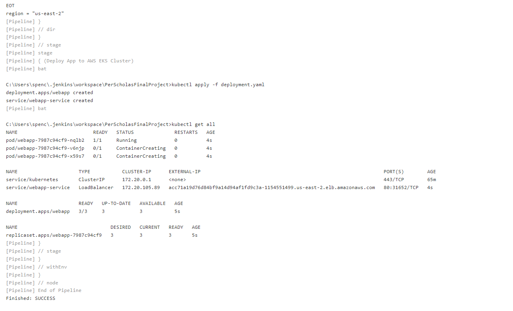
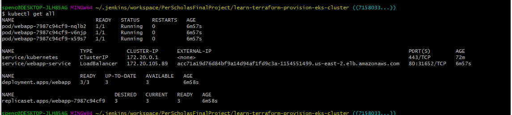

## **DevOps Resources**
---
#### **ReactJS**
Developed my app with JavaScript's React framework.

#### **Visual Studio Code**
VS Code Provided an IDE with Linting and mult-language detection features to create my app alongside files essential for the CI/CD

#### **Git & GitHub**
Version controlling was handled by Git, and I was able to store my updates in a GitHub repository.

#### **Ngrok**
Ngrok provided a port fowarding service to allow webhooks to occur between my GitHub repo and Jenkins.

#### **Jenkins**
Jenkins is the heart of my CI/CD pipeline, and automatically rebuilds a new Docker image with every app version update. It also deploys the application to my deployments in the AWS Cloud environment.

#### **Docker**
Docker contains our image to be used for lightweight deployment. In this project, I managed to make my application image even lighter by creating a production build of my app and serving it with Nginx. This conversion occurs inside of the Dockerfile.

#### **Kubernetes**
The application deployment is controlled by Kubernetes. In this case I had Terraform establish EKS clustering, and was able to define my deployment with the deployment.yaml file.

#### **Terraform**
Terraform was used to provision cloud resources, including EC2 instances, EKS resources and an Elastic IP.

#### **AWS**
AWS is the cloud environment that this project was deployed to.

